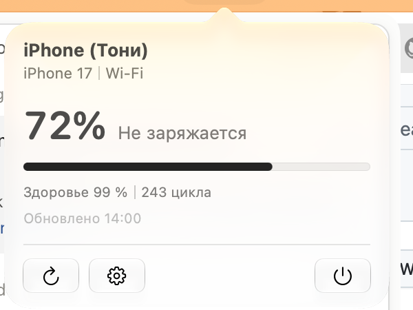
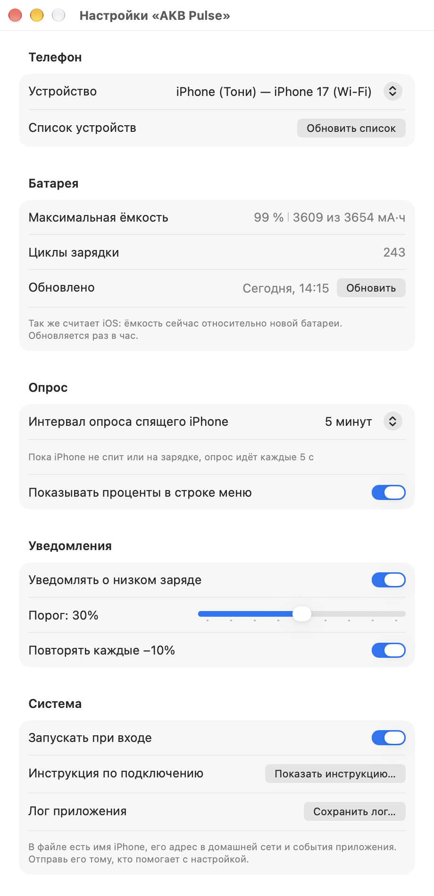
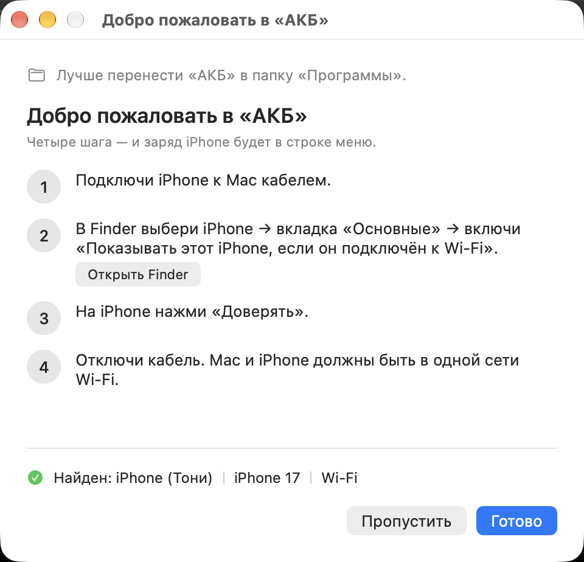

# AKB Pulse — заряд iPhone в строке меню macOS

**Скачать:** [AKB-Pulse-1.3.1.dmg](https://github.com/TonyDanzza/AKB-Pulse/releases/latest/download/AKB-Pulse-1.3.1.dmg) — macOS 26+, Apple Silicon.

При первом запуске: правая кнопка → Открыть (приложение подписано без Apple Developer ID).

Маленькая утилита для macOS 26+: показывает заряд iPhone в строке меню
(иконка и «72 %»), красит иконку красным и присылает уведомление, когда
телефон садится ниже порога. Заодно показывает здоровье батареи —
максимальную ёмкость и число циклов, те же цифры, что в iOS «Настройки →
Батарея → Состояние». Иконки в Dock нет.

Данные берутся по Wi-Fi через `lockdownd` — теми же утилитами
libimobiledevice, что использует Finder. Bluetooth заряд iPhone для Mac
не отдаёт, поэтому этот путь не используется.

Спящий iPhone, который просто лежит на столе, тоже показывается. Он
перестаёт объявлять себя в Bonjour, и `idevice_id -n` возвращает пусто, но
порт `lockdownd` на его адресе в локальной сети открыт волнами — телефон
регулярно просыпается для push. AKB Pulse помнит адрес телефона и в такие
моменты читает заряд напрямую по IP (помощник `akb-direct` внутри
приложения). Адрес не забывается после неудачной минуты, а если телефон
всё-таки переехал, AKB Pulse находит его заново тремя путями: по имени хоста
через mDNS, по MAC в таблице соседей и через usbmuxd. Если телефон не отвечает дольше 15 минут, число остаётся на
экране, но приглушается, а в окне пишется «Нет связи ▏данные 14:32».


## Здоровье батареи

В окне строки меню под полосой заряда стоит строка «Здоровье 99 % ▏243 цикла»,
а в настройках, в разделе «Батарея», те же цифры подробнее: максимальная
ёмкость (99 % — это 3609 из 3654 мА·ч) и циклы зарядки.



Числа приходят от самого телефона: сервис `com.apple.mobile.diagnostics_relay`
отдаёт запись IORegistry `AppleSmartBattery` по той же доверенной паре, что и
заряд, — кабель не нужен. Проценты считаются как в iOS: текущая полная ёмкость
относительно проектной.

Здоровье меняется медленно, поэтому спрашивается раз в час, сразу после
удачного чтения заряда; после неудачи следующая попытка не раньше чем через
десять минут. Последние цифры сохраняются между запусками и показываются с
датой — пока телефон спит, вчерашние 99 % честнее пустоты.

Серийный номер батареи в ответе телефона есть, но приложение его не читает
и никуда не пишет: помощник печатает только белый список полей.



## Что нужно один раз сделать на телефоне

1. Подключи iPhone к Mac кабелем.
2. Finder → выбери iPhone в боковом меню → вкладка «Основные» → включи
   «Показывать этот iPhone, если он подключён к Wi-Fi». Нажми «Применить».
3. На iPhone нажми «Доверять» и введи код-пароль.
4. Отключи кабель. Mac и iPhone должны быть в одной сети Wi-Fi.

Проверить руками, что всё готово:

```bash
idevice_id -n                                   # должен вывести UDID
ideviceinfo -n -u <UDID> -q com.apple.mobile.battery
```

Второй командой телефон отвечает строками `BatteryCurrentCapacity`,
`BatteryIsCharging`, `ExternalConnected`, `FullyCharged` — это и есть всё,
что читает приложение.

### Если iPhone не находится

Обнаружение по Wi-Fi идёт через Bonjour/mDNS в локальной сети. Если на Mac
или iPhone включён VPN — разреши в нём доступ к локальной сети или выключи
его на время поиска: VPN часто режет mDNS, и `idevice_id -n` возвращает
пусто, даже когда всё остальное настроено правильно. Ещё проверь, что
телефон разблокирован и находится в той же сети Wi-Fi, что и Mac.

Если телефон найден, но заряд не обновляется, пока он спит, загляни в
Системные настройки → «Конфиденциальность и безопасность» → «Локальная
сеть» и разреши AKB Pulse. Без этого разрешения система прячет от приложения
MAC-адреса соседей: `arp -an` приходит пустым, а в маршрутной таблице
вместо адресов стоит `02:00:00:00:00:00`. Когда так случается, AKB Pulse пишет об
этом в лог и показывает в окне кнопку, открывающую нужный раздел настроек.

## Установка

### Установка из GitHub

1. Скачай образ по ссылке в начале файла.
2. Открой образ и перетащи `AKB.app` в папку «Программы».
3. Запусти через правую кнопку → «Открыть» → «Открыть» ещё раз: обычный
   двойной клик система заблокирует.

### После установки

1. Запусти. Homebrew и `brew install libimobiledevice` не нужны:
   утилиты и библиотеки лежат внутри приложения.
2. Разреши уведомления, когда система спросит, — иначе не придёт
   предупреждение о низком заряде.
3. Автозапуск включается в настройках: «Система» → «Запускать при входе».

### Первый запуск

При первом запуске откроется окно с четырьмя шагами и живым статусом
внизу: «Ищу iPhone…» превращается в «Найден: iPhone (Тони)», как только
телефон виден по Wi-Fi. Шаги те же, что и выше: кабель → галочка в Finder
→ «Доверять» на телефоне → отключить кабель. Окно можно открыть снова:
настройки → «Система» → «Показать инструкцию…».



### Если Mac не даёт открыть

Приложение подписано ad-hoc, без Developer ID, поэтому на чужом Mac
система скажет, что не может проверить разработчика. Правый клик по
`AKB.app` → «Открыть» → «Открыть» ещё раз. Либо: Системные настройки →
«Конфиденциальность и безопасность» → внизу «Всё равно открыть».

## Сборка из исходников

Нужны Xcode 26+ и `xcodegen` (`brew install xcodegen`).

```bash
cd /Users/tonydanzza/Documents/AKB
xcodegen generate
xcodebuild -project AKB.xcodeproj -scheme AKB -configuration Debug \
    -derivedDataPath build build
open build/Build/Products/Debug/AKB.app
```

Тесты:

```bash
xcodebuild -project AKB.xcodeproj -scheme AKB -configuration Debug \
    -derivedDataPath build test -destination 'platform=macOS'
```

Сборка для раздачи:

```bash
./scripts/make-dmg.sh       # → dist/AKB-Pulse-1.3.1.dmg (готовый образ)
./scripts/package.sh        # → dist/AKB-Pulse-1.3.1.zip (просто архив)
```

Оба скрипта собирают Release. Утилиты libimobiledevice встраиваются в
бандл автоматически, шагом сборки `scripts/bundle-libimobiledevice.sh`:
он копирует `idevice_id` и `ideviceinfo` в `Contents/Helpers`, тянет за
ними все не-системные dylib в `Contents/Frameworks`, переписывает пути
через `install_name_tool` и заново подписывает. Проверить:

```bash
otool -L build/Build/Products/Release/AKB.app/Contents/Helpers/* | grep homebrew
# пусто — значит на Homebrew ничего не завязано
```

### Отладка без телефона

Приложение умеет притворяться. Переменные окружения:

| Переменная | Что делает |
|---|---|
| `AKB_FAKE_PERCENT=72` | показывает выдуманные 72 % вместо опроса телефона |
| `AKB_FAKE_CHARGING=1` | к фейковому заряду добавляет «заряжается» |
| `AKB_FAKE_NO_DEVICE=1` | «iPhone не найден» — проверить пустое состояние |
| `AKB_FAKE_NO_TOOL=1` | «нет libimobiledevice» — проверить второе пустое состояние |
| `AKB_FAKE_NO_HEALTH=1` | здоровье не читается — проверить раздел «Батарея» без данных |
| `AKB_FAKE_STALE_AFTER=20` | фейковый телефон «засыпает» через 20 с — проверить «Нет связи» |
| `AKB_FAKE_TOGGLE_CHARGING=8` | зарядка включается и выключается каждые 8 с — видно, что иконка в строке меню обновляется сама |

```bash
AKB_FAKE_PERCENT=25 build/Build/Products/Debug/AKB.app/Contents/MacOS/AKB &
```

Логи приложения (видно, каким путём получен заряд — `usbmuxd` или `direct`,
с какого адреса и за сколько секунд):

```bash
log stream --predicate 'subsystem == "ru.tonydanzza.akb"' --level info
```

Помощник для спящего телефона можно позвать и руками:

```bash
H=/Applications/AKB.app/Contents/Helpers/akb-direct
"$H" mac <UDID>                    # 34:10:be:d8:21:09 — MAC из записи сопряжения
"$H" addr <UDID>                   # IP, если usbmuxd сейчас видит телефон
"$H" battery 192.168.1.11 <UDID>   # заряд напрямую по IP
"$H" health 192.168.1.11 <UDID>    # здоровье батареи напрямую по IP
"$H" health - <UDID>               # то же через usbmuxd, если телефон не спит
"$H" watch                         # поток событий usbmuxd: ADD/REMOVE
```

Код 3 значит «рукопожатие не удалось»: телефон в этот момент спит.
Это нормально — приложение повторяет запрос каждые 3 секунды в течение 40.

## Настройки

- **Телефон** — какой iPhone опрашивать, если их несколько. По умолчанию
  выбирается устройство семейства iPhone 17, иначе первое найденное.
- **Батарея** — здоровье: максимальная ёмкость, циклы зарядки и время
  последнего чтения. Кнопка «Обновить» спрашивает телефон сразу,
  не дожидаясь часа.
- **Опрос** — интервал опроса спящего iPhone: 30 с / 1 мин / 2 мин / 5 мин,
  и переключатель «показывать проценты в строке меню».
- **Уведомления** — порог 10…50 % (по умолчанию 30 %) и повтор на каждой
  ступени −10 % (30 → 20 → 10).
- **Система** — автозапуск, кнопка «Показать инструкцию…» и «Сохранить лог…».

Опрос выполняется также при пробуждении Mac и при открытии окна.

## Лог

AKB Pulse пишет события в `~/Library/Logs/AKB/akb.log` (ротация по 2 МБ, хранится три
файла). Кнопка «Сохранить лог…» в настройках складывает в один текстовый файл
шапку (версия, macOS, модель Mac, откуда запущено приложение, где найдены
помощники, интервал и порог), весь файловый лог и хвост системного unified log
за два часа, и предлагает сохранить его на Рабочий стол.

**В этом файле есть имя iPhone, его UDID и адрес в домашней сети.** Так и
задумано: без них не понять, почему заряд не читается. Отправляй файл только
тому, кто помогает с настройкой.

## Расход батареи

Один опрос — это несколько пакетов в локальной сети и короткое TLS-рукопожатие
с телефоном; трафика и работы там на доли секунды. Телефон мы не будим: AKB Pulse
только пользуется теми моментами, когда он проснулся сам, а запросы к спящему
телефону до него просто не доходят. Пока экран Mac спит или сессия
заблокирована, опрос полностью остановлен и возобновляется при пробуждении.
Пока телефон на зарядке, AKB Pulse спрашивает его каждые 5 секунд: он в это время
и так не спит, отвечает за доли секунды, а состояние меняется быстро. Так же
часто AKB Pulse спрашивает и просто бодрствующий телефон — тот, который сам виден
в сети; интервал из настроек касается только спящего.

## Передать другому

Собери `./scripts/make-dmg.sh` и отдай `dist/AKB-Pulse-1.3.1.dmg`. Ставить ничего
не нужно: libimobiledevice уже внутри. Получателю остаётся два шага —
включить для своего телефона галочку Wi-Fi в Finder (окно первого запуска
показывает, как) и при первом открытии обойти Gatekeeper, как описано выше.

Чтобы приложение открывалось совсем без предупреждений, нужны подпись
Developer ID и нотаризация у Apple. В этой версии их нет.

### Лицензии

libimobiledevice, libplist, libusbmuxd и libimobiledevice-glue — LGPL-2.1,
OpenSSL — Apache-2.0. Библиотеки подключены динамически, их можно заменить
своей сборкой. Тексты лицензий лежат в `AKB.app/Contents/Resources/Licenses/`.

## Как устроено

```
Sources/AKB/
  AKBApp.swift                    сцена Settings; строка меню — на AppKit
  Model/                          BatteryStatus, BatteryHealth, PhoneDevice, ProductTypeMap
  Services/
    BatteryProvider.swift         протокол источника данных
    IMobileDeviceProvider.swift   idevice_id / ideviceinfo + прямой путь по IP
    IMobileDeviceOutputParser.swift  чистый парсер (покрыт тестами)
    ProcessRunner.swift           Process вне главного потока, таймаут 10 с
    ToolLocator.swift             поиск бинарников
    DeviceAddressResolver.swift   кэш → имя (mDNS) → arp → usbmuxd: адрес телефона
    ARPTable.swift                разбор `arp -an` и та же таблица через sysctl
    HostnameResolver.swift        getaddrinfo/getnameinfo без внешних процессов
    BonjourHostname.swift         имя телефона по MAC из `_apple-mobdev2._tcp`
    PortProbe.swift               стук в порт 62078 на секунду (предпроверка)
    RetryWindow.swift             окно повторов 40 с с предпроверкой (покрыто тестами)
    BatteryMonitor.swift          @Observable состояние и таймер опроса
    AlertPolicy.swift             когда слать уведомление (покрыто тестами)
    NotificationService.swift     UNUserNotificationCenter
    LaunchAtLogin.swift           SMAppService
    AKBLog.swift                  единая точка: os.Logger + файловый лог
    FileLog.swift                 ~/Library/Logs/AKB с ротацией (покрыт тестами)
    SupportReport.swift           сборка файла для поддержки (покрыт тестами)
    Prefs.swift                   UserDefaults: адрес телефона и здоровье батареи
  Views/                          StatusItemController (NSStatusItem + NSPopover),
                                  MenuBarLabel (рендер иконки), StatusPopoverView,
                                  SettingsView, EmptyStateView,
                                  OnboardingView, Hairline,
                                  HealthFormatter (числа здоровья, покрыт тестами)
  Services/DeviceEventWatcher.swift события usbmuxd → немедленный опрос
Helpers/akb-direct/               помощник на C: заряд и здоровье по IP, MAC,
                                  адрес, события
Tests/AKBTests/                   249 тестов, Swift Testing
```

```
scripts/
  dev/click-menubar.swift      клик по строке меню для снимков экрана
  bundle-libimobiledevice.sh   встраивает утилиты и dylib в бандл
  make-dmg.sh                  Release → dist/AKB-Pulse-1.3.1.dmg
  package.sh                   Release → dist/AKB-Pulse-1.3.1.zip
```

Сторонних SPM-зависимостей нет — только системные фреймворки.
Песочница выключена: без неё `Process` не сможет запустить встроенные
`Contents/Helpers/ideviceinfo`.

`ToolLocator` ищет утилиты в таком порядке: бандл приложения →
`/opt/homebrew/bin` → `/usr/local/bin` → `/opt/local/bin` → `/usr/bin`.
Настройки этого пути в UI нет: почти всегда работает бандл.
